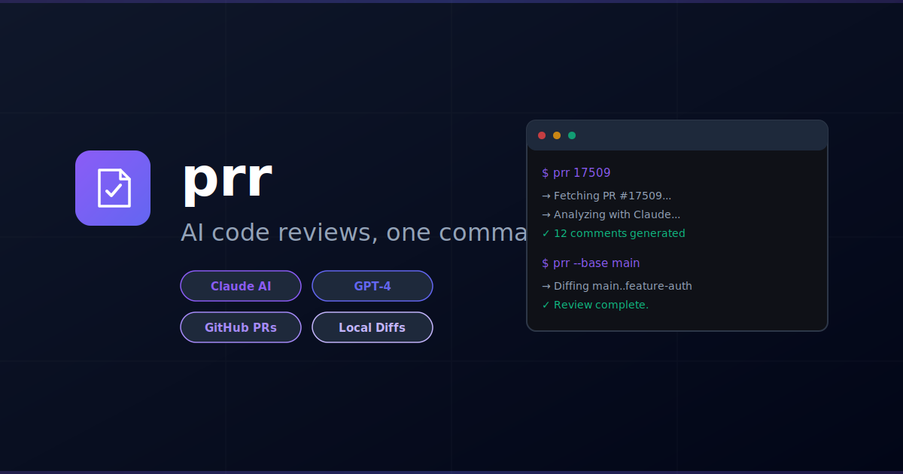

# prr — AI-Powered PR Code Review CLI



[](https://github.com/dotbrains/prr/actions/workflows/ci.yml)
[](https://github.com/dotbrains/prr/actions/workflows/release.yml)
[](https://opensource.org/licenses/MIT)


Run AI-powered code reviews on GitHub pull requests or local git branches. Outputs structured, human-readable markdown comments for easy copy-paste into GitHub.

## Quick Start

```sh
# Install
go install github.com/dotbrains/prr@latest

# Review the current branch's PR
prr

# Review a specific PR
prr 17509

# Review with a specific agent
prr 17509 --agent gpt

# Review with all configured agents
prr 17509 --all

# Review any PR by URL (no need to clone or cd into the repo)
prr https://github.com/owner/repo/pull/123

# Review a local branch against main (no PR required)
prr --base main

# Review a specific repo and branch
prr --repo /path/to/repo --base main --head feature-branch

# Focus review on specific areas
prr 17509 --focus security,performance

# Post review directly to GitHub
prr post

# Generate a PR description
prr describe 17509
prr describe 17509 --update   # push to GitHub

# Ask follow-up questions about a review
prr ask "Is this race condition exploitable?"

# Compare two review runs
prr diff ~/.local/share/prr/reviews/pr-123-run1 ~/.local/share/prr/reviews/pr-123-run2

# Skip codebase pattern analysis
prr 17509 --no-context
```

## How It Works

**PR mode** (default):
1. Resolves the PR number (from an argument, URL, or auto-detects from the current branch via `gh`).
2. Fetches the PR diff and metadata using the GitHub CLI.
3. Sends the diff to an AI agent (Claude by default).
4. Writes structured review comments to `~/.local/share/prr/reviews/pr-<number>-<timestamp>/`.

**URL mode** (pass a PR URL):
1. Parses the GitHub PR URL to extract owner, repo, and PR number.
2. Uses `gh -R owner/repo` to fetch diff and metadata remotely — no cloning needed.
3. Review proceeds identically to PR mode.

**Local mode** (`--repo` or `--base`):
1. Diffs two branches in any local git repo (no GitHub PR needed).
2. Sends the diff to an AI agent.
3. Writes review comments to `~/.local/share/prr/reviews/review-<base>-vs-<head>-<timestamp>/`.

In both modes, `prr` automatically reads sibling files from the same directories as the changed files to give the AI context about established codebase patterns. This can be disabled with `--no-context` or `review.codebase_context: false` in the config.

Output is organized into severity-based subdirectories (`critical/`, `suggestion/`, `nit/`, `praise/`), each containing one markdown file per reviewed source file — designed for direct copy-paste into GitHub's PR review interface.

## Installation

### Via `go install`

```sh
go install github.com/dotbrains/prr@latest
```

### Via Homebrew

```sh
brew tap dotbrains/tap
brew install --cask prr
```

### Via GitHub Release

```sh
gh release download --repo dotbrains/prr --pattern 'prr_darwin_arm64.tar.gz' --dir /tmp
tar -xzf /tmp/prr_darwin_arm64.tar.gz -C /usr/local/bin
```

### From source

```sh
git clone https://github.com/dotbrains/prr.git
cd prr
make install
```

## Configuration

```sh
# Create default config
prr config init

# Set your API key
export ANTHROPIC_API_KEY=sk-...

# Check agent status
prr agents
```

Config lives at `~/.config/prr/config.yaml`.

To disable codebase pattern analysis by default:

```yaml
review:
  codebase_context: false
```

To only see specific severity levels (e.g. skip nits and praise):

```yaml
output:
  severities:
    - critical
    - suggestion
```

See [SPEC.md](SPEC.md) for the full config format.

## Commands

| Command | Description |
|---|---|
| `prr [PR_NUMBER]` | Run AI code review on a PR |
| `prr <PR_URL>` | Review any PR by URL (no need to be in the repo) |
| `prr --base <branch>` | Review current branch against a base branch (local mode) |
| `prr --repo <path> --base <branch>` | Review a specific local repo |
| `prr agents` | List configured agents and their status |
| `prr post` | Post a review to GitHub as a PR review |
| `prr describe [PR_NUMBER]` | Generate an AI-written PR description |
| `prr ask <question>` | Ask follow-up questions about a review |
| `prr diff <dir1> <dir2>` | Compare two review outputs |
| `prr config init` | Create default config file |
| `prr history` | List past reviews |
| `prr clean` | Remove old review output |

## Output

PR reviews:
```
~/.local/share/prr/reviews/
  pr-17509-20250311-143000/
    summary.md                        # Overall review
    critical/
      src-auth-handler-go.md          # Per-file comments
    suggestion/
      src-middleware-session-go.md
    nit/
      src-auth-handler-go.md
```

Local branch reviews:
```
~/.local/share/prr/reviews/
  review-main-vs-feature-auth-20250311-143000/
    summary.md
    critical/
      src-auth-handler-go.md
    suggestion/
      src-auth-handler-go.md
```

Comments are organized into subdirectories by severity level (`critical`, `suggestion`, `nit`, `praise`). Only directories with comments are created.

## Dependencies

- **[git](https://git-scm.com/)** — required for local mode
- **[gh](https://cli.github.com/)** — GitHub CLI (required for PR mode)
- **API key** — for your chosen AI provider (e.g. `ANTHROPIC_API_KEY` for Claude)

## License

MIT
