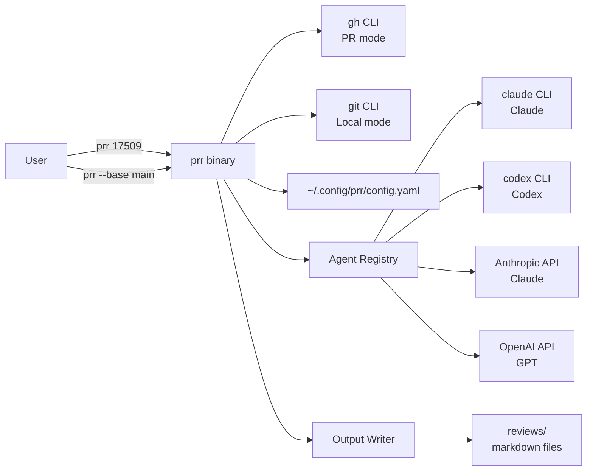
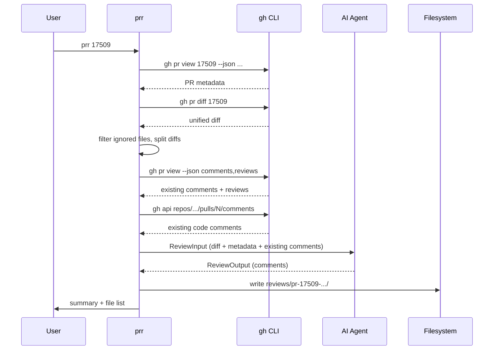

# prr — AI-Powered PR Code Review CLI

[](https://github.com/dotbrains/prr/actions/workflows/ci.yml)
[](https://github.com/dotbrains/prr/actions/workflows/release.yml)
[](https://opensource.org/licenses/MIT)


A lightweight CLI that runs AI-powered code reviews on GitHub pull requests or local git branches and outputs structured, human-readable markdown comments for easy copy-paste into GitHub. Two modes: **PR mode** (resolve PR → fetch diff via `gh` → send to AI agent → write review) and **local mode** (diff two branches in any git repo → send to AI agent → write review).

## Problem

Code reviews are time-consuming. AI can accelerate the process by catching bugs, suggesting improvements, and flagging issues — but existing tools either:

- Live inside GitHub (require integrations, permissions, noisy bot comments).
- Produce output that sounds obviously AI-generated ("I notice that...", "Consider...").
- Are monolithic and locked to a single AI provider.

`prr` is local-first, provider-agnostic, and writes comments that read like a senior engineer wrote them.

## Configuration

`prr` reads its configuration from `~/.config/prr/config.yaml`. If the file does not exist, built-in defaults are used (Claude CLI).

### Config file format

```yaml
default_agent: claude-cli

agents:
  claude-cli:
    provider: claude-cli
    model: sonnet

  codex-cli:
    provider: codex-cli
    model: codex

  claude-api:
    provider: anthropic
    model: claude-sonnet-4-20250514
    api_key_env: ANTHROPIC_API_KEY
    max_tokens: 8192

  gpt-api:
    provider: openai
    model: gpt-4o
    api_key_env: OPENAI_API_KEY
    max_tokens: 8192

review:
  max_diff_lines: 10000
  ignore_patterns:
    - "*.lock"
    - "go.sum"
    - "package-lock.json"
    - "yarn.lock"
    - "vendor/**"
    - "node_modules/**"
    - "*.min.js"
    - "*.min.css"
    - "*.generated.*"
  severity_levels:
    - critical
    - suggestion
    - nit
    - praise

output:
  dir: reviews
```

### `prr config init`

Scaffolds a config file with the built-in defaults:

```
$ prr config init
✓ Wrote default config to ~/.config/prr/config.yaml
Edit the file to add your API keys and customize agents.
```

Refuses to overwrite an existing file unless `--force` is passed.

### Adding agents

Edit `~/.config/prr/config.yaml` directly. Add a new entry under `agents:` with the provider, model, and API key environment variable. No rebuild required — changes take effect on the next `prr` invocation.

Adding a new provider (e.g. Google Gemini, local Ollama) requires implementing the `Agent` interface in a new package under `internal/agent/` and registering it in the agent registry.

## Commands

### `prr [PR_NUMBER]`

Run an AI code review on a pull request (PR mode).

- If `PR_NUMBER` is omitted, auto-detects from the current branch via `gh pr status --json number`.
- Fetches the PR diff and metadata via `gh pr diff` and `gh pr view`.
- Sends the diff to the configured AI agent.
- Writes structured review output to `reviews/pr-<number>-<timestamp>/`.

Steps:
1. Resolves PR number (explicit arg or auto-detect from current branch).
2. Fetches PR metadata (title, body, base branch, head branch, file list).
3. Fetches the full diff via `gh pr diff <number>`.
4. Fetches existing PR comments, reviews, and line-level code comments for context.
5. Filters out files matching `ignore_patterns`.
6. Validates diff size against `max_diff_lines` (splits into batches if exceeded).
7. Sends diff + metadata + existing comments to the AI agent with the review system prompt.
8. Parses the structured response into review comments.
9. Writes output to `reviews/pr-<number>-<timestamp>/`.
10. Prints a summary to stdout.

### `prr --base <branch>` / `prr --repo <path> --base <branch>`

Run an AI code review on local git branches (local mode). No GitHub PR required.

- `--repo <path>` — Path to a local git repo. Defaults to the current working directory if `--base` is provided without `--repo`.
- `--base <branch>` — Base branch to diff against. If omitted when `--repo` is provided, auto-detects the default branch (`origin/HEAD`, `main`, or `master`).
- `--head <branch>` — Head branch. Defaults to the current branch (`HEAD`).

When `--repo` or `--base` is provided, `prr` enters local mode and skips all `gh` operations.

Steps:
1. Validates the repo path is a git repository.
2. Resolves base branch (explicit or auto-detect default).
3. Resolves head branch (explicit or current branch).
4. Validates base ≠ head.
5. Fetches the diff via `git diff base...head`.
6. Filters out files matching `ignore_patterns`.
7. Validates diff size against `max_diff_lines`.
8. Sends diff + branch metadata to the AI agent (no existing comments — local mode has no PR context).
9. Parses the structured response into review comments.
10. Writes output to `reviews/review-<base>-vs-<head>-<timestamp>/`.
11. Prints a summary to stdout.

```
$ prr --base main
→ Local review: main → feature/auth
→ repo:  /Users/dev/myproject
→ files:  8 (2 filtered)
→ agent:  claude (sonnet)
→ Reviewing...

✓ Review complete.
→ 1 critical, 3 suggestions, 2 nits
→ Output: reviews/review-main-vs-feature-auth-20250311-143000/
```

```
$ prr 17509
→ PR #17509: Fix user authentication race condition
→ agent:  claude (claude-sonnet-4-20250514)
→ files:  12 (3 filtered)
→ Reviewing...

✓ Review complete.
→ 2 critical, 5 suggestions, 3 nits, 1 praise
→ Output: reviews/pr-17509-20250311-143000/

Files:
  summary.md
  files/src-auth-handler-go.md        (2 comments)
  files/src-middleware-session-go.md   (3 comments)
  files/cmd-server-go.md              (1 comment)
  files/internal-db-queries-go.md     (4 comments)
  files/README-md.md                  (1 comment)
```

### `prr [PR_NUMBER] --agent <name>`

Use a specific configured agent instead of the default:

```
$ prr 17509 --agent gpt
→ PR #17509: Fix user authentication race condition
→ agent:  gpt (gpt-4o)
...
```

### `prr [PR_NUMBER] --all`

Run the review with **all** configured agents in parallel. Output is nested by agent name:

```
$ prr 17509 --all
→ PR #17509: Fix user authentication race condition
→ agents: claude, gpt
→ Reviewing with 2 agents...

✓ Review complete.
→ Output: reviews/pr-17509-20250311-143000/

  claude/
    summary.md
    files/...
  gpt/
    summary.md
    files/...
```

### `prr agents`

List all configured agents and their status:

```
$ prr agents
  claude-cli   claude-cli   sonnet                         -                    ✓ (cli) (default)
  codex-cli    codex-cli    codex                          -                    ✓ (cli)
  claude-api   anthropic    claude-sonnet-4-20250514       ANTHROPIC_API_KEY    ✓
  gpt-api      openai       gpt-4o                         OPENAI_API_KEY       ✗ (not set)

Default: claude-cli
```

CLI providers show `✓ (cli)` — they use local CLI binaries and don't need API keys. API providers show `✓` / `✗` based on whether the API key environment variable is set.

### `prr history`

List past reviews in the `reviews/` directory:

```
$ prr history
  pr-17509-20250311-143000  PR #17509  claude   2 critical, 5 suggestions
  pr-17480-20250310-091500  PR #17480  claude   0 critical, 3 suggestions
  pr-17455-20250309-160000  PR #17455  gpt      1 critical, 2 suggestions
```

### `prr clean [--days <n>]`

Remove old review output. Defaults to reviews older than 30 days:

```
$ prr clean --days 7
→ Removing 3 reviews older than 7 days...
✓ Cleaned up 3 review directories.
```

### Global Flags

| Flag | Description |
|---|---|
| `--agent` | Use a specific configured agent (default: from config) |
| `--all` | Run review with all configured agents in parallel |
| `--output-dir` | Override the output directory (default: `reviews/`) |
| `--repo` | Path to a local git repo (enables local mode) |
| `--base` | Base branch to diff against (enables local mode) |
| `--head` | Head branch (defaults to current branch) |
| `--version` | Print the version and exit |
| `--help` | Show help for any command |

### Command-Specific Flags

**`prr` (review):**
- `--agent` — Use a specific agent by name
- `--all` — Review with all configured agents
- `--output-dir` — Override output directory
- `--repo` — Path to a local git repo (enables local mode)
- `--base` — Base branch to diff against (enables local mode)
- `--head` — Head branch (defaults to current branch)
- `--no-praise` — Skip positive/praise comments
- `--min-severity` — Minimum severity to include (`critical`, `suggestion`, `nit`)

**`prr config init`:**
- `--force` — Overwrite existing config file

**`prr clean`:**
- `--days` — Remove reviews older than N days (default: 30)
- `--dry-run` — Show what would be removed without deleting

## Mode Resolution

`prr` operates in one of two modes based on the flags provided:

**Local mode** — activated when `--repo` or `--base` is provided:
1. Resolves repo path (`--repo` or current working directory).
2. Validates the path is a git repository.
3. Resolves base branch (`--base`, or auto-detects default via `origin/HEAD` → `main` → `master`).
4. Resolves head branch (`--head`, or current branch via `git rev-parse --abbrev-ref HEAD`).
5. If base == head, exits with an error.

**PR mode** (default) — the `prr` command shares the same resolution pattern as other dotbrains CLIs:
1. If a positional argument is provided, use it as the PR number (validated as an integer).
2. Otherwise, run `gh pr status --json number` and extract `currentBranch.number`.
3. If no PR is found or `gh` fails, exit with an error.

## Output Format

### Directory Structure

PR mode — single agent (default):

```
reviews/
  pr-17509-20250311-143000/
    summary.md
    files/
      src-auth-handler-go.md
      src-middleware-session-go.md
      cmd-server-go.md
```

Local mode — single agent:

```
reviews/
  review-main-vs-feature-auth-20250311-143000/
    summary.md
    files/
      src-auth-handler-go.md
```

Branch names with slashes are sanitized (`feature/auth` → `feature-auth`).

Multi-agent (`--all`):

```
reviews/
  pr-17509-20250311-143000/
    claude/
      summary.md
      files/
        src-auth-handler-go.md
    gpt/
      summary.md
      files/
        src-auth-handler-go.md
```

The same nesting applies to local mode (`review-<base>-vs-<head>-<timestamp>/claude/...`).

### `summary.md`

A high-level review of the changes. Header varies by mode:

PR mode:
```markdown
# PR #17509 — Fix user authentication race condition

**Agent:** claude (claude-sonnet-4-20250514)
**Date:** 2025-03-11 14:30:00
```

Local mode:
```markdown
# Review: main → feature/auth

**Agent:** claude (sonnet)
**Date:** 2025-03-11 14:30:00
```

Both include:

```markdown

## Overview

The session token refresh has a TOCTOU race — two concurrent requests
can both see an expired token, both refresh it, and one overwrites the
other's new token. The fix adds a mutex around the refresh path, which
is correct, but the lock scope is wider than it needs to be.

## Stats

- 2 critical
- 5 suggestions
- 3 nits
- 1 praise
```

### Per-File Comment Files

Each file in `files/` contains comments for a single source file, organized by line number. Format is designed for direct copy-paste into GitHub:

```markdown
# src/auth/handler.go

## Line 42 — critical

The mutex is acquired but never released in the error path on line 47.
This will deadlock under concurrent load when `refreshToken()` returns
an error.

Add a `defer mu.Unlock()` immediately after the lock, or restructure
so the early return can't skip the unlock:

---

## Lines 55-60 — suggestion

This re-fetches the user from the database on every request even when
the session is still valid. Pull the user lookup inside the `if expired`
branch — you'll cut a DB round-trip on every authenticated request.

---

## Line 78 — nit

`userID` is shadowed by the short variable declaration on line 80.
Not a bug here, but it makes the function harder to follow.
```

## Existing Comments as Context

When reviewing a PR (PR mode only), `prr` fetches existing comments already posted on the PR and includes them as context for the AI agent. This prevents the AI from repeating feedback that's already been given, and lets it focus on new issues.

> **Note:** Local mode does not fetch existing comments — there is no PR to pull context from.

### What's fetched

Three types of existing feedback are fetched via `gh`:

1. **Conversation comments** — General PR discussion comments (issue-level).
   - Source: `gh pr view <n> --json comments`
2. **Review summaries** — Top-level review bodies with state (APPROVED, CHANGES_REQUESTED, etc.).
   - Source: `gh pr view <n> --json reviews`
3. **Line-level review comments** — Code-specific comments on files/lines.
   - Source: `gh api repos/{owner}/{repo}/pulls/{n}/comments --paginate`

Conversation comments and review summaries are fetched in a single `gh pr view --json comments,reviews` call. Line-level comments require a separate `gh api` call using the repo slug (auto-detected via `gh repo view --json nameWithOwner`).

### How it's used

Existing comments are appended to the user prompt after the diff, organized into sections:
- `EXISTING PR COMMENTS` — conversation-level comments with author
- `EXISTING REVIEWS` — review summaries with author and state
- `EXISTING CODE COMMENTS` — line-level comments grouped by file

The system prompt instructs the AI to:
- Not repeat or rephrase existing feedback.
- Focus on new issues not yet raised.
- Use existing comments to calibrate the review.

### Failure handling

Comment fetching is non-fatal. If `gh` fails to fetch comments (e.g., auth issues, API rate limits), a warning is printed to stderr and the review proceeds without existing context.

## Agent Architecture

### Interface

All AI providers implement a single interface:

```go
type Agent interface {
    // Name returns the agent's configured name (e.g. "claude").
    Name() string

    // Review sends a PR diff to the AI and returns structured review output.
    Review(ctx context.Context, input *ReviewInput) (*ReviewOutput, error)
}
```

### Types

```go
type ReviewInput struct {
    PRNumber   int
    PRTitle    string
    PRBody     string
    BaseBranch string
    HeadBranch string
    Diff       string
    Files      []FileDiff

    // Existing PR comments for context
    ExistingComments       []gh.ExistingComment
    ExistingReviews        []gh.ExistingReview
    ExistingReviewComments []gh.ExistingReviewComment
}

type FileDiff struct {
    Path    string
    Diff    string
    Status  string // added, modified, deleted, renamed
}

type ReviewOutput struct {
    Summary  string
    Comments []ReviewComment
}

type ReviewComment struct {
    File     string
    StartLine int
    EndLine   int
    Severity string // critical, suggestion, nit, praise
    Body     string
}
```

### Provider Registry

Providers are registered at init time. Adding a new provider requires:

1. Create a package under `internal/agent/<provider>/` implementing the `Agent` interface.
2. Register the provider in `internal/agent/registry.go`.

```go
var providers = map[string]ProviderFactory{
    "claude-cli": claudecli.New,   // CLI-based (default)
    "codex-cli":  codexcli.New,    // CLI-based
    "anthropic":  anthropic.New,   // API-based
    "openai":     openai.New,      // API-based
}
```

### Current Providers

**Claude CLI** (`claude-cli`) — **Default**
- Shells out to the `claude` binary in non-interactive print mode (`claude -p`).
- Uses `--output-format json` for structured output, `--system-prompt` for review instructions, `--model` for model selection.
- User prompt piped via stdin (handles large diffs).
- No API key required — uses existing Claude Code subscription auth.
- Requires: `claude` CLI installed and authenticated.

**Codex CLI** (`codex-cli`)
- Shells out to the `codex` binary in non-interactive exec mode (`codex exec`).
- Uses `--json` for JSONL output, `--approval-mode suggest` for read-only operation.
- System prompt embedded in user prompt (Codex doesn't support `--system-prompt`).
- No API key required for subscription users; `CODEX_API_KEY` supported for API-based auth.
- Requires: `codex` CLI installed and authenticated.

**Anthropic API** (`anthropic`)
- Uses the Anthropic Messages API (`/v1/messages`).
- Sends the diff as a structured user message with the review system prompt.
- Parses the response into `ReviewOutput` via a structured output format instruction.
- Requires: `ANTHROPIC_API_KEY` environment variable.

**OpenAI API** (`openai`)
- Uses the OpenAI Chat Completions API (`/v1/chat/completions`).
- Same prompt structure, adapted for OpenAI's message format.
- Parses the response identically.
- Requires: `OPENAI_API_KEY` environment variable.

### Adding a New Provider

1. Create `internal/agent/ollama/ollama.go`:

```go
package ollama

type OllamaAgent struct { ... }

func New(cfg AgentConfig) (agent.Agent, error) { ... }
func (a *OllamaAgent) Name() string { ... }
func (a *OllamaAgent) Review(ctx context.Context, input *agent.ReviewInput) (*agent.ReviewOutput, error) { ... }
```

2. Register in `internal/agent/registry.go`:

```go
"ollama": ollama.New,
```

3. Add config:

```yaml
agents:
  local:
    provider: ollama
    model: llama3
    api_key_env: ""  # not needed for local
```

## Human-Like Comment Writing

The system prompt instructs the AI to write comments that read like a senior engineer, not a bot. Key prompt directives:

**Do:**
- Be direct and specific. Reference exact line numbers and variable names.
- Explain *why* something is a problem, not just *what* is wrong.
- Suggest concrete fixes with short code snippets when helpful.
- Use a casual-professional tone — the kind you'd use in a real PR review.
- Vary sentence structure. Mix short and long sentences.
- Say "this will deadlock" not "this could potentially lead to a deadlock scenario."
- Use first person sparingly and naturally ("I'd extract this into a helper").

**Don't:**
- Start comments with "I notice that..." or "It appears that..." or "Consider...".
- Use hedge words excessively ("perhaps", "might want to", "could potentially").
- Add disclaimers ("I'm an AI", "I might be wrong").
- Write in bullet points for every comment — use prose.
- Over-explain obvious things.
- Use corporate-speak ("leverage", "utilize", "facilitate").
- Praise excessively or add filler compliments.

**Severity guidelines:**
- `critical` — Bugs, security issues, data loss risks, deadlocks, race conditions. Things that must be fixed before merge.
- `suggestion` — Performance improvements, better patterns, clearer abstractions. The code works but could be meaningfully better.
- `nit` — Style, naming, minor readability. Not worth blocking a PR over.
- `praise` — Genuinely good patterns worth calling out. Use sparingly — only when something is notably well done.

## Dependencies

- **git** — Required for local mode (`--repo` / `--base`). Uses `git diff`, `git rev-parse`, `git symbolic-ref` via `git -C <path>`.
- **gh** (GitHub CLI) — PR number auto-detection, diff fetching, PR metadata. Required for PR mode.
- **claude** (Claude Code CLI) — Required for `claude-cli` provider. Install via `npm install -g @anthropic-ai/claude-code`.
- **codex** (OpenAI Codex CLI) — Required for `codex-cli` provider. Install via `npm install -g @openai/codex`.
- **Network access** — Required for API-based providers. CLI providers handle auth internally.

For local mode, only `git` is required. For PR mode, `gh` is required. The AI CLI (`claude` or `codex`) must be installed for the respective CLI provider. API-based providers (`anthropic`, `openai`) use Go's `net/http` directly.

## Installation

### Via `go install`

```sh
go install github.com/dotbrains/prr@latest
```

### Via Homebrew

```sh
brew tap dotbrains/tap
brew install --cask prr
```

### Via GitHub Release

```sh
# macOS Apple Silicon
gh release download --repo dotbrains/prr --pattern 'prr_darwin_arm64.tar.gz' --dir /tmp
tar -xzf /tmp/prr_darwin_arm64.tar.gz -C /usr/local/bin
```

Available archives: `prr_darwin_arm64`, `prr_darwin_amd64`, `prr_linux_arm64`, `prr_linux_amd64`.

### From source

```sh
git clone https://github.com/dotbrains/prr.git
cd prr
make install
```

## Architecture



### Review Pipeline



## Implementation Language

**Go**. Single static binary with no runtime dependencies. Cross-compiles to macOS (arm64/amd64) and Linux.

Key libraries:
- **`github.com/spf13/cobra`** — command/subcommand routing (`prr`, `prr config init`, `prr agents`)
- **`os/exec`** — shell out to `gh`, `claude`, and `codex` CLIs
- **`net/http`** — HTTP client for API-based AI provider calls
- **`encoding/json`** — parse `gh` CLI output and AI API responses
- **`gopkg.in/yaml.v3`** — parse and write config YAML
- **`text/template`** — generate markdown output files
- **Standard library `testing`** — unit tests with table-driven patterns and interface-based mocks

## Package Structure

```
prr/
├── main.go                       # Entry point, version injection
├── cmd/                          # Cobra commands
│   ├── root.go                   # Root command, global flags, PR resolution
│   ├── root_test.go              # Root command + PR resolution tests
│   ├── review.go                 # `prr [PR_NUMBER]` — main review command
│   ├── review_test.go            # Review command tests
│   ├── agents.go                 # `prr agents` — list configured agents
│   ├── agents_test.go            # Agents command tests
│   ├── config.go                 # `prr config init` — scaffold config
│   ├── config_test.go            # Config command tests
│   ├── history.go                # `prr history` — list past reviews
│   ├── history_test.go           # History command tests
│   ├── clean.go                  # `prr clean` — remove old reviews
│   └── clean_test.go             # Clean command tests
├── internal/
│   ├── agent/                    # Agent abstraction layer
│   │   ├── agent.go              # Agent interface + types (ReviewInput, ReviewOutput, etc.)
│   │   ├── registry.go           # Provider registry (factory map)
│   │   ├── registry_test.go      # Registry tests
│   │   ├── prompt.go             # System prompt construction (human-like writing rules)
│   │   ├── prompt_test.go        # Prompt tests
│   │   ├── parse.go              # Shared JSON response parsing (ParseReviewJSON)
│   │   ├── parse_test.go         # Parse tests
│   │   ├── claudecli/            # Claude CLI provider (default)
│   │   │   ├── claudecli.go      # Agent implementation (shells out to claude)
│   │   │   └── claudecli_test.go # Provider tests (mock exec)
│   │   ├── codexcli/             # Codex CLI provider
│   │   │   ├── codexcli.go       # Agent implementation (shells out to codex)
│   │   │   └── codexcli_test.go  # Provider tests (mock exec)
│   │   ├── anthropic/            # Anthropic API provider
│   │   │   ├── anthropic.go      # Agent implementation
│   │   │   └── anthropic_test.go # Provider tests (mock HTTP)
│   │   └── openai/               # OpenAI API provider
│   │       ├── openai.go         # Agent implementation
│   │       └── openai_test.go    # Provider tests (mock HTTP)
│   ├── config/                   # Configuration loading
│   │   ├── config.go             # Load/save/defaults for ~/.config/prr/config.yaml
│   │   └── config_test.go        # Config tests
│   ├── diff/                     # Diff parsing and filtering
│   │   ├── parser.go             # Parse unified diff into FileDiff structs
│   │   ├── parser_test.go        # Parser tests
│   │   ├── filter.go             # Apply ignore_patterns to file list
│   │   └── filter_test.go        # Filter tests
│   ├── gh/                       # GitHub CLI wrapper
│   │   ├── client.go             # PR resolution, diff fetching, metadata
│   │   └── client_test.go        # Client tests (mock exec)
│   ├── git/                      # Local git CLI wrapper
│   │   ├── client.go             # Branch detection, diff fetching, repo validation
│   │   └── client_test.go        # Client tests (mock exec)
│   ├── writer/                   # Output file generation
│   │   ├── writer.go             # Write ReviewOutput to markdown files
│   │   └── writer_test.go        # Writer tests
│   └── exec/                     # Command execution abstraction
│       └── executor.go           # CommandExecutor interface + RealExecutor
├── .github/workflows/
│   ├── ci.yml                    # CI: test, lint, build
│   └── release.yml               # Release via GoReleaser
├── .goreleaser.yaml              # Cross-compilation config
├── Makefile                      # build, test, lint, install targets
├── SPEC.md                       # Technical specification
└── README.md                     # User-facing documentation
```

## Testing Strategy

Target: **≥ 80% code coverage**. Tests must not require real API keys or network access.

### Unit Tests

All core logic is tested by injecting interfaces/mocks for external dependencies (gh CLI, HTTP client, filesystem).

| Area | What to test | Mocking approach |
|---|---|---|
| **PR resolution** | Explicit arg, auto-detect via gh, invalid input, no PR found | Mock `gh` JSON response |
| **Diff parsing** | Unified diff → `FileDiff` structs, multi-file diffs, renames, binary files | Pure logic, no mocks |
| **Diff filtering** | Glob patterns exclude correct files, edge cases (nested paths, wildcards) | Pure logic, no mocks |
| **Agent registry** | Known provider → factory, unknown provider → error, duplicate registration | Pure logic, no mocks |
| **Anthropic agent** | Correct API request (headers, body, model), parse response, handle errors (rate limit, auth, malformed) | Mock HTTP server (`httptest`) |
| **OpenAI agent** | Same as Anthropic, adapted for OpenAI response format | Mock HTTP server (`httptest`) |
| **Prompt construction** | System prompt includes severity levels, human-writing rules, PR/local context | Assert on string content |
| **Git client** | IsRepo, GetCurrentBranch, GetDefaultBranch (origin/HEAD → main → master), GetDiff, GetCommitCount | Mock `git` commands |
| **Output writer** | Correct directory structure, file naming, markdown formatting, multi-agent nesting | Temp directory (`t.TempDir()`) |
| **Config loading** | Load from YAML, fallback to defaults, invalid YAML error, round-trip | Temp directory with fixture files |
| **History listing** | Correct parsing of review directory names, sorting, empty state | Temp directory |
| **Clean command** | Age filtering, dry-run mode, empty state | Temp directory |

### What is NOT tested

- Real AI API calls (requires API keys and costs money).
- Real `gh` CLI authentication.
- Visual review of comment quality (manual QA).

### CI

Tests run on every push. Coverage is measured per-package and enforced at ≥ 80%.

## GitHub Actions

Two workflows: **CI** (every push/PR) and **Release** (on version tags).

### CI — `.github/workflows/ci.yml`

Triggered on push to `main` and all pull requests.

**Jobs:**

1. **test**
   - Matrix: `go: [stable]`, `os: [ubuntu-latest, macos-latest]`
   - Steps: checkout → setup Go → `go vet ./...` → `go test -race -coverprofile=coverage.out ./...` → enforce ≥ 80% coverage → upload coverage artifact

2. **lint**
   - Uses `golangci/golangci-lint-action@v8`
   - Runs `golangci-lint run`

3. **build**
   - Runs `go build -o prr .` to verify the binary compiles
   - Runs on both macOS and Linux

### Release — `.github/workflows/release.yml`

Triggered on tags matching `v*` (e.g. `v0.1.0`).

Uses [GoReleaser](https://goreleaser.com) to build, package, and publish.

**GoReleaser config** (`.goreleaser.yaml`):

```yaml
version: 2

builds:
  - binary: prr
    goos: [darwin, linux]
    goarch: [amd64, arm64]
    ldflags:
      - -s -w -X main.version={{.Version}}

homebrew_casks:
  - repository:
      owner: dotbrains
      name: homebrew-tap
      token: "{{ .Env.HOMEBREW_TAP_TOKEN }}"
    name: prr
    homepage: https://github.com/dotbrains/prr
    description: AI-powered PR code review CLI
    license: "MIT"
    binaries: [prr]
    hooks:
      post:
        install: |
          if OS.mac?
            system_command "/usr/bin/xattr", args: ["-dr", "com.apple.quarantine", "#{staged_path}/prr"]
          end

archives:
  - formats: [tar.gz]
    name_template: "{{ .ProjectName }}_{{ .Os }}_{{ .Arch }}"

checksum:
  name_template: checksums.txt

changelog:
  sort: asc
  filters:
    exclude:
      - "^docs:"
      - "^chore:"
```

## Example Workflows

### Quick review of current branch's PR

```
$ prr
→ PR #17509: Fix user authentication race condition
→ agent:  claude (claude-sonnet-4-20250514)
→ files:  12 (3 filtered)
→ Reviewing...

✓ Review complete.
→ 2 critical, 5 suggestions, 3 nits, 1 praise
→ Output: reviews/pr-17509-20250311-143000/
```

### Review a specific PR with a specific agent

```
$ prr 17480 --agent gpt
→ PR #17480: Add rate limiting middleware
→ agent:  gpt (gpt-4o)
→ files:  6 (1 filtered)
→ Reviewing...

✓ Review complete.
→ 0 critical, 4 suggestions, 2 nits
→ Output: reviews/pr-17480-20250311-150000/
```

### Compare reviews from multiple agents

```
$ prr 17509 --all
→ PR #17509: Fix user authentication race condition
→ agents: claude, gpt
→ Reviewing with 2 agents...

✓ Review complete.
→ Output: reviews/pr-17509-20250311-143000/

  claude/  2 critical, 5 suggestions, 3 nits
  gpt/     1 critical, 3 suggestions, 4 nits
```

### Review local branches (no PR required)

```
$ prr --base main
→ Local review: main → feature/auth
→ repo:  .
→ files:  8 (2 filtered)
→ agent:  claude (sonnet)
→ Reviewing...

✓ Review complete.
→ 1 critical, 3 suggestions, 2 nits
→ Output: reviews/review-main-vs-feature-auth-20250311-143000/
```

### Review a specific repo

```
$ prr --repo ../other-project --base develop --head feature/api --agent gpt
→ Local review: develop → feature/api
→ repo:  ../other-project
→ files:  15 (4 filtered)
→ agent:  gpt (gpt-4o)
→ Reviewing...

✓ Review complete.
→ 0 critical, 6 suggestions, 3 nits
→ Output: reviews/review-develop-vs-feature-api-20250311-160000/
```

### Copy-paste a comment into GitHub

```
$ cat reviews/pr-17509-20250311-143000/files/src-auth-handler-go.md
```

```markdown
# src/auth/handler.go

## Line 42 — critical

The mutex is acquired but never released in the error path on line 47.
This will deadlock under concurrent load when `refreshToken()` returns
an error.

Add a `defer mu.Unlock()` immediately after the lock.

---

## Lines 55-60 — suggestion

This re-fetches the user from the database on every request even when
the session is still valid. Pull the user lookup inside the `if expired`
branch — you'll cut a DB round-trip on every authenticated request.
```

### First-time setup

```
$ prr config init
✓ Wrote default config to ~/.config/prr/config.yaml
Edit the file to add your API keys and customize agents.

$ export ANTHROPIC_API_KEY=sk-...
$ prr agents
  claude  anthropic  claude-sonnet-4-20250514  ANTHROPIC_API_KEY ✓

Default: claude
```

## Design Decisions

### 1. Local-first, no GitHub integration

`prr` writes to local files instead of posting comments directly to GitHub. This is intentional:

- The user maintains full control over what gets posted. No accidental bot spam.
- Comments can be reviewed, edited, and cherry-picked before posting.
- Works without GitHub API tokens or webhook permissions.
- Review output persists locally for reference.
- Local mode (`--repo` / `--base`) works entirely offline — no GitHub needed at all.

### 2. Provider-agnostic agent interface

The `Agent` interface is deliberately minimal (one method: `Review`). This makes it trivial to add new providers without touching any other code. The registry pattern means the config file alone controls which agents are available — no feature flags or build tags needed.

### 3. Human-like output via prompt engineering, not post-processing

Rather than running AI output through a "humanizer" filter, `prr` uses a carefully crafted system prompt that instructs the model to write like a senior engineer from the start. This produces more natural, contextually appropriate comments than any post-processing could achieve. The prompt is versioned and testable.

### 4. File-per-source-file output organization

Review comments are split into one markdown file per reviewed source file. This maps directly to how GitHub PRs are organized (file-by-file review) and makes copy-paste straightforward. The alternative (one giant file, or grouped by severity) was rejected because it doesn't match the GitHub workflow.

### 5. Structured AI response parsing

The AI is instructed to return comments in a structured format (JSON) which `prr` parses into `ReviewComment` structs. The markdown files are then generated from these structs — not from raw AI text. This ensures consistent formatting and enables features like severity filtering (`--min-severity`), stats aggregation, and multi-agent comparison.

## Non-Goals

- **Direct GitHub comment posting.** `prr` is intentionally local-only. A future `prr post` command may be added, but it is not in scope for v1.
- **Real-time / streaming reviews.** The review runs to completion and writes output. No streaming UI.
- **IDE integration.** `prr` is a CLI tool. IDE plugins are out of scope.
- **Fine-tuning or training.** `prr` uses off-the-shelf models via their APIs. No custom model training.
